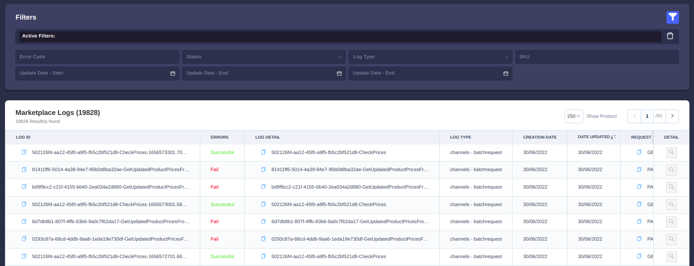
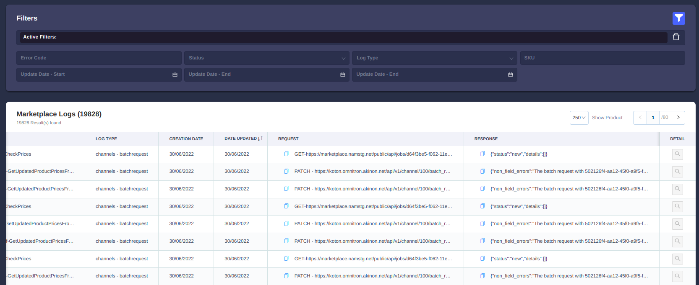
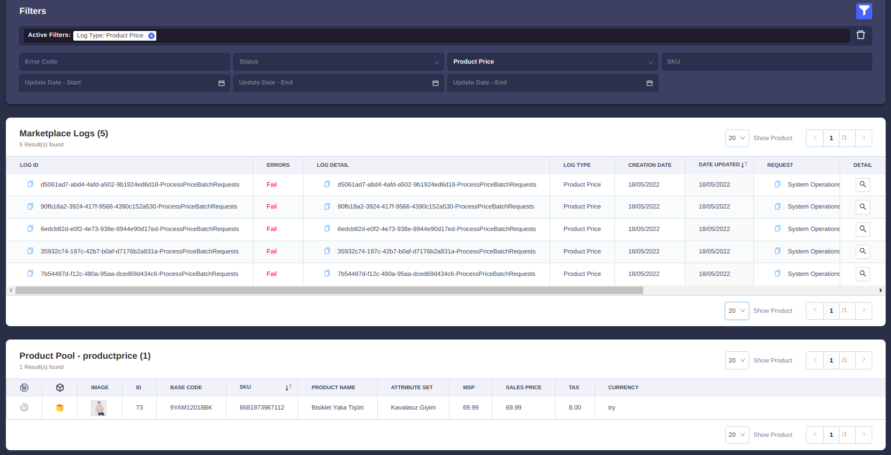

Sales Channel Logları
=======================

Sales Channel'ın olduğu kanala geçilir.

Menu -> Sales Channels -> Sales Channel Settings -> Marketplace Logs

---------------------------

-------------------

**Ürün Detayları**

Ürün ile ilgili detay bilgi bulunması halinde bu kısım açılabilir.
Tabloda bulunan detay kolonu tıklanabilir olur.

----------------

Tablo Başlıkları
----------------

:Log Id: Hangi işlemin yapıldığı gözükür. Formatı {batchrequest local batch id}-{İşlemin adı}-{uniqlik sağlayacak ekstra bilgi}
:Log Detail: Log Id ile aynıdır
:Errors: Status ü gösterir Succesful veya Fail
:Log type: İşlemin türünün bilgisidir.
:request: İşlemde istek atılıyorsa bu istek ile ilgili bilgiler bulunur.
:response: İşlemde bir cevap alınıyor ise bu bilgiler tutulur.
:Detail: Log type product, productprice, productstock ise detaylarını sayfanın altında yeni bir pencerede gösterilir.

Filtreler
---------

:Error Code: Log Id alanında arama yapılır
:Status: Errors alanında Successful veya Fail seçilebilir.
:Log Type: Log type alanında arama yapar.
:Update Date Start: Oluşturulma Tarih aralığı başlangıç.
:Update Date End: Oluşturulma Tarih aralığı bitti.

